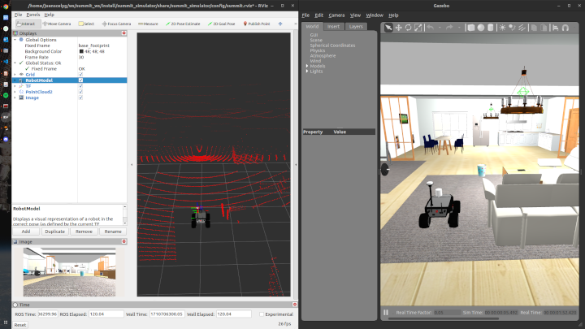

# Summit Simulator 


[](https://github.com/Summit-Harmonic/summit_simulator/actions/workflows/jazzy.yaml)

This package allows running a simulation in different Gazebo worlds, using the Summit Platform by [Robotnik Automation](https://github.com/RobotnikAutomation)

It is supported by [Intelligent Robotics Labs](https://github.com/IntelligentRoboticsLabs) and it could be used for educational purposes.



## Installation 

Prepare your thirparty repos:
```bash
sudo apt update
sudo apt install python3-vcstool python3-pip python3-rosdep python3-colcon-common-extensions -y
cd <ros2-workspace>/src
vcs import < summit_simulator/thirdparty.repos
```
*Check if the installation was successfully.*

## Building project

```bash
cd <ros2-workspace>
rosdep install --from-paths src --ignore-src -r -y
colcon build --symlink-install --cmake-args -DBUILD_TESTING=OFF
``` 
## Setup Environment

Add it to your `.bashrc` file
```bash
source /usr/share/gazebo/setup.bash
source <ros2-workspace>/install/setup.bash
``` 
Also it works with `.zshrc` changing by the correct extension file.

## Run Gazebo Simulation in ROS 2

To launch the gazebo simulation:
```bash
ros2 launch summit_simulator robot_gazebo.launch.py world_name:=urjc_excavation
``` 
- **world_name**: The name of the world to be loaded. The default is `urjc_excavation`. You should change if you have another world in your workspace. For this change, also you must change the package name in the launch file. 

For this step, your robot will be spawned in the world. You can see the robot in the Gazebo client.

### Close Gazebo Client

Otherwise, you can close the Gazebo client:
```bash
pkill -f gzclient
``` 

## License

Shield: 

[![CC BY-SA 4.0][cc-by-sa-shield]][cc-by-sa]

This work is licensed under a
[Creative Commons Attribution-ShareAlike 4.0 International License][cc-by-sa].

[![CC BY-SA 4.0][cc-by-sa-image]][cc-by-sa]

[cc-by-sa]: http://creativecommons.org/licenses/by-sa/4.0/
[cc-by-sa-image]: https://licensebuttons.net/l/by-sa/4.0/88x31.png
[cc-by-sa-shield]: https://img.shields.io/badge/License-CC%20BY--SA%204.0-lightgrey.svg
