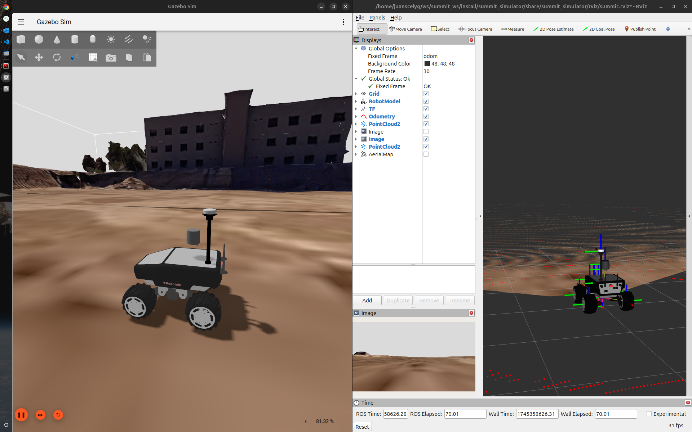

# Summit Simulator - Repo Under Construction


This package allows running different Gazebo worlds, using the Summit Platform by [Robotnik Automation](https://github.com/RobotnikAutomation)




# Installation 

Prepare your thirparty repos:
```bash
sudo apt update
sudo apt install python3-vcstool python3-pip python3-rosdep python3-colcon-common-extensions -y
cd <ros2-workspace>/src
vcs import < summit_simulator/thirdparty.repos
```
*Check if the installation was succesfully.*

# Building project

```bash
cd <ros2-workspace>
rosdep install --from-paths src --ignore-src -r -y
colcon build --symlink-install --cmake-args -DBUILD_TESTING=OFF
``` 
# Setup Environment

Add it to your `.bashrc` file
```bash
source /usr/share/gazebo/setup.bash
source <ros2-workspace>/install/setup.bash
``` 
Also it works with `.zshrc` changing by the correct extension file.

# Run Gazebo & Tiago in ROS2
Launch the robot state publisher :

```bash
ros2 launch summit_simulator robotnik_base_sim.launch.py
``` 
Try to launch the gazebo simulation:
```bash
ros2 launch summit_simulator robot_gazebo.launch.py
``` 

Otherwise, you can close the Gazebo client:
```bash
pkill -f gzclient
``` 

## License

Shield: 

[![CC BY-SA 4.0][cc-by-sa-shield]][cc-by-sa]

This work is licensed under a
[Creative Commons Attribution-ShareAlike 4.0 International License][cc-by-sa].

[![CC BY-SA 4.0][cc-by-sa-image]][cc-by-sa]

[cc-by-sa]: http://creativecommons.org/licenses/by-sa/4.0/
[cc-by-sa-image]: https://licensebuttons.net/l/by-sa/4.0/88x31.png
[cc-by-sa-shield]: https://img.shields.io/badge/License-CC%20BY--SA%204.0-lightgrey.svg
